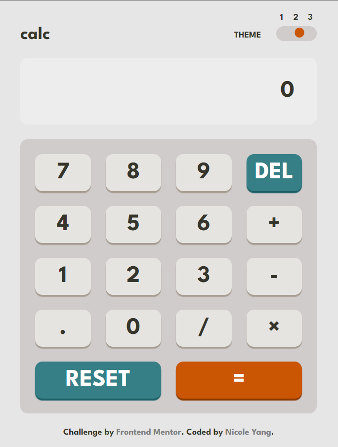

# Frontend Mentor - Calculator app solution

This is a solution to the [Calculator app challenge on Frontend Mentor](https://www.frontendmentor.io/challenges/calculator-app-9lteq5N29). Frontend Mentor challenges help you improve your coding skills by building realistic projects. 

## Table of contents

- [Overview](#overview)
  - [The challenge](#the-challenge)
  - [Screenshot](#screenshot)
  - [Links](#links)
- [My process](#my-process)
  - [Built with](#built-with)
  - [Useful resources](#useful-resources)
- [Author](#author)

## Overview

### The challenge

Users should be able to:

- See the size of the elements adjust based on their device's screen size
- Perform mathematical operations like addition, subtraction, multiplication, and division
- Adjust the color theme based on their preference

### Screenshot

	
	
	

### Links

- Solution URL: [https://www.frontendmentor.io/solutions/calculator-app-using-css-grid-and-sass-15t9RMaY4D](https://www.frontendmentor.io/solutions/calculator-app-using-css-grid-and-sass-15t9RMaY4D)
- Live Site URL: [https://nicoleyyr.github.io/calculator-app/](https://nicoleyyr.github.io/calculator-app/)

## My process

### Built with

- Semantic HTML5 markup
- CSS custom properties
- Flexbox
- CSS Grid
- [SASS](https://sass-lang.com/) - For styles

### Useful resources

- [A Complete Guide to Flexbox](https://css-tricks.com/snippets/css/a-guide-to-flexbox/) & [A Complete Guide to CSS Grid](https://css-tricks.com/snippets/css/complete-guide-grid/) - They are my wikipedia 😍 super useful pages
- [How to build an HTML calculator app from scratch using JavaScript](https://www.freecodecamp.org/news/how-to-build-an-html-calculator-app-from-scratch-using-javascript-4454b8714b98/) - This helped me for the calculation logic.

## Author

- Website - [Nicole Yang](https://www.nicoleyry.com/)
- Frontend Mentor - [@nicoleyyr](https://www.frontendmentor.io/profile/nicoleyyr)
- Twitter - [@nicoleyry](https://twitter.com/nicoleyry)